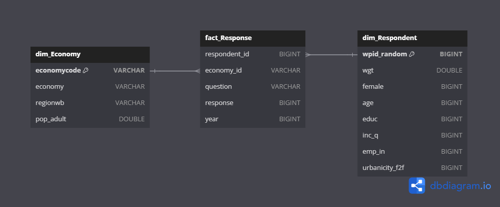

# Data Usage

After running the pipeline, you'll have access to the below data artifacts

## Data Warehouse

`warehouse.duckdb` contains the following tables which serve as the data marts:



You may consult with the [data dictionary](https://microdata.worldbank.org/index.php/catalog/4607/data-dictionary/F1?file_name=micro_world_139countries.dta) for more information on these fields.

You are free to use this file to create your own visualizations using other BI tools. However, keep in mind that this data is still under the World Bank's [Terms of Use](https://microdata.worldbank.org/index.php/terms-of-use) for Public Use data.

## Evidence Site

To run the Evidence dashboard locally, run the below commands. This assumes that you have already run the data pipeline:

```bash
cd src/pipeline_evidence

# If running for the first time
npm run sources

npm run dev

# If using devcontainer
# npm run dev -- --host 0.0.0.0
```

## Sources

For more information, you may consult with the below resources:

* [World Bank Microdata Library](https://microdata.worldbank.org/)
* [Evidence Documentation](https://docs.evidence.dev)
